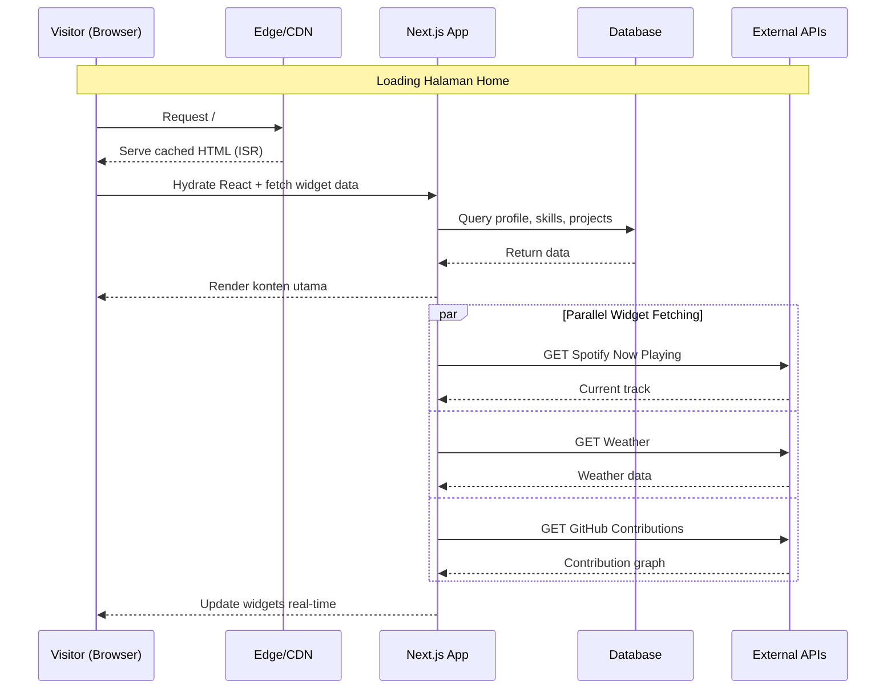
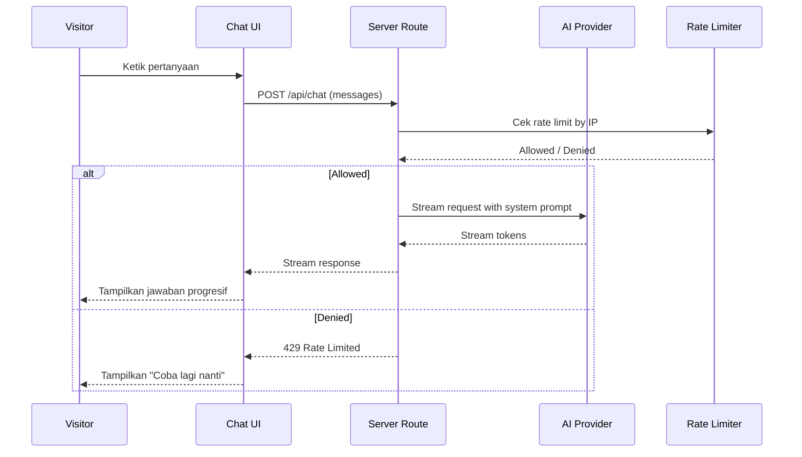
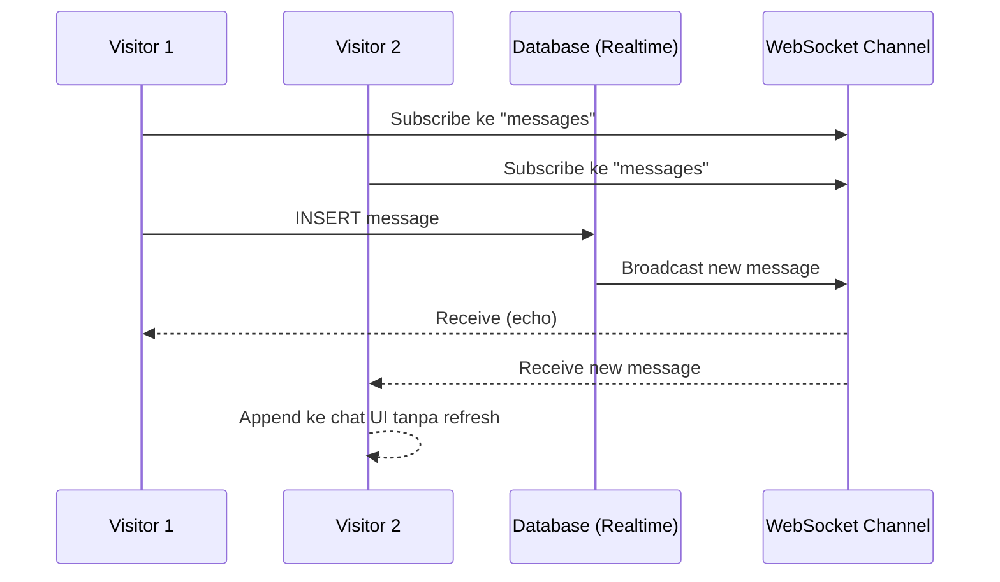
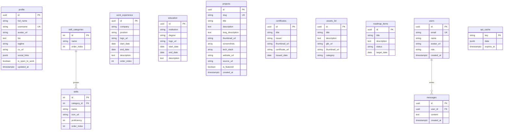

# PRD — Personal Portfolio Web

> **Project:** Portfolio Web Pribadi Eki
> **Versi:** 2.0
> **Tanggal:** 16 Mei 2026
> **Status:** Draft — siap eksekusi
> **Referensi Visual:** `https://azure.nateee.com`

---

## 1. Overview

Portfolio web ini bertujuan menjadi **personal hub digital** Eki yang menggabungkan tiga peran dalam satu tempat: dokumentasi profil profesional, dashboard aktivitas real-time, dan playground untuk eksperimen mini-app pribadi. Berbeda dari portfolio konvensional yang hanya menampilkan CV statis, web ini didesain sebagai *living website* — kontennya terus terupdate otomatis dari berbagai sumber (GitHub, coding tracker, music streaming, blog platform) tanpa perlu intervensi manual.

Masalah yang ingin diselesaikan adalah **fragmentasi identitas digital**: saat ini informasi tentang Eki tersebar di LinkedIn (CV), GitHub (kode), Dev.to/Medium (tulisan), MonkeyType (typing skill), dan lain-lain. Portfolio web ini menjadi *single source of truth* yang menampilkan semuanya dalam satu URL.

Tujuan utamanya adalah menyediakan platform berbasis web yang:
- **Bagi pengunjung umum (recruiter/komunitas):** Cara cepat memahami siapa Eki dalam satu scroll
- **Bagi Eki sendiri:** Showcase aktif yang otomatis update tanpa perlu maintenance manual, plus diferensiasi sebagai Software Engineer + 3D Artist + Linux Enthusiast

## 2. Requirements

Persyaratan tingkat tinggi untuk pengembangan sistem:

- **Aksesibilitas:** Aplikasi harus dapat diakses melalui web browser di semua device (desktop, tablet, mobile), responsive-first design.
- **Pengguna:** Dua role — Visitor (public, tanpa login) dan Admin Tunggal (Eki, akses penuh untuk CRUD konten).
- **Personalisasi:** Pengunjung yang login mendapat akses ke fitur tambahan (chat, komentar). Pengunjung tanpa login tetap bisa melihat seluruh konten utama.
- **Real-time Data:** Widget aktivitas (coding stats, music, weather, GitHub contributions) harus terupdate otomatis tanpa redeploy.
- **Content Management:** Konten utama (project, blog, certificates) harus dapat ditambah/diedit tanpa perlu coding ulang.
- **Diferensiasi:** Harus ada widget 3D asset interaktif sebagai pembeda dari portfolio Software Engineer lain.
- **Privacy & Compliance:** Tidak menyimpan data pengunjung lebih dari yang diperlukan; ada halaman Terms & Privacy Policy.
- **Performance:** Lighthouse score minimal 90 untuk Performance, Accessibility, Best Practices, dan SEO di desktop & mobile.
- **Multi-platform:** Mendukung PWA untuk instalasi di mobile.

## 3. Core Features

Fitur-fitur kunci yang harus ada dalam versi pertama:

1. **Halaman Utama (Home)**
   - Hero section dengan typing animation peran (Software Engineer, 3D Artist, dll).
   - About card dengan foto, deskripsi singkat, dan tombol download CV.
   - Skills marquee dengan animasi scrolling 100+ skill.
   - Work Experience & Education sebagai card list.
   - Activity widgets: GitHub Contributions, Coding Progress, Typing Performance, Language Learning Progress.
   - Latest Certifications section.

2. **Manajemen Project**
   - Halaman daftar project dengan filter & search.
   - Halaman detail project dengan deskripsi panjang, screenshots, tech stack, dan link demo/source.
   - Admin dapat menambah, mengedit, dan menghapus project.

3. **Agregasi Blog**
   - Tab Dev.to & Medium dengan card preview artikel.
   - Klik card mengarah ke artikel asli (atau halaman detail internal).
   - Sinkronisasi otomatis dari API/RSS.

4. **Tools Playground**
   - Multi-tab single page dengan beberapa tools utility (WPM Test, Postal Code Lookup, Crypto Tracker, Online Compiler, dll).
   - Setiap tool standalone, tidak saling tergantung.

5. **AI Assistant**
   - Chat interface mirip ChatGPT, fokus menjawab pertanyaan tentang Eki.
   - Streaming response untuk UX yang baik.
   - Rate limiting per IP untuk mencegah penyalahgunaan.

6. **Real-time Chat**
   - Guest book interaktif untuk visitor yang login.
   - Pesan tampil real-time tanpa perlu refresh.

7. **3D Asset Showcase** *(Diferensiasi Eki)*
   - Viewer interaktif untuk asset GLB dari Gamma Game Assets.
   - Kontrol rotasi, zoom, dan pan.
   - Lazy load untuk performa.

8. **Authentication**
   - Login dengan email/password dan OAuth GitHub.
   - Sidebar update menampilkan info user setelah login.

9. **Sidebar Widgets**
   - Visitor Info (IP, lokasi, browser).
   - Spotify Now Playing.
   - Weather widget.
   - Quick Stats (jumlah project, tahun pengalaman, dll).
   - Open to Work badge.

10. **Roadmap & Changelog Publik**
    - Halaman roadmap menampilkan fitur planned/in-progress/done.
    - Halaman changelog menampilkan history update website per versi.

11. **Halaman Legal & Certificates**
    - Daftar lengkap sertifikat dengan thumbnail dan link preview.
    - Terms of Service & Privacy Policy.

## 4. User Flow

### 4.1. Flow Visitor (Tanpa Login)

1. **Landing:** Visitor membuka URL portfolio → langsung melihat hero section.
2. **Exploration:** Scroll homepage untuk melihat about, skills, experience, education, activity widgets, dan 3D showcase.
3. **Deep Dive:** Klik menu Project → browse list → klik salah satu untuk detail → buka demo atau source di tab baru.
4. **Content Reading:** Klik menu Blog → pilih tab Dev.to/Medium → klik artikel untuk baca lengkap.
5. **Playground:** Klik menu Tools → coba salah satu tool (misal WPM Test).
6. **AI Interaction:** Klik menu Etan AI → tanya tentang Eki via chat.
7. **Exit:** Visitor dapat informasi yang dibutuhkan, mungkin save URL atau download CV.

### 4.2. Flow Visitor yang Login

1. **Login:** Visitor klik tombol Sign In di sidebar → pilih method (email/OAuth) → autentikasi.
2. **Personalisasi Aktif:** Sidebar menampilkan nama & avatar visitor.
3. **Chat:** Visitor dapat mengakses fitur `/chat` untuk berinteraksi dengan visitor lain yang online.
4. **Logout:** Visitor dapat keluar dari sesi kapan saja.

### 4.3. Flow Admin (Eki)

1. **Login:** Eki masuk dengan akun admin (verifikasi via email khusus).
2. **Content Management:** Eki mengakses Supabase Studio atau halaman admin internal untuk:
   - Tambah/edit/hapus project.
   - Tambah/edit/hapus certificate.
   - Upload 3D asset GLB.
   - Update profile (bio, tagline, status open-to-work).
3. **Monitoring:** Eki mengecek dashboard aktivitas (visitor count, popular pages — opsional).
4. **Verifikasi:** Konten yang diupdate langsung muncul di website (revalidate ISR atau real-time).

## 5. Architecture

### 5.1. High-Level Data Flow



### 5.2. Flow AI Assistant



### 5.3. Flow Real-time Chat



## 6. Database Schema

Entity Relationship Diagram untuk struktur database utama:



| Tabel | Deskripsi |
|---|---|
| **profile** | Data profil owner (single row) — bio, tagline, status open-to-work |
| **skill_categories & skills** | Master data skill dikelompokkan per kategori |
| **work_experience** | Riwayat pekerjaan dengan rentang waktu |
| **education** | Riwayat pendidikan formal & informal |
| **projects** | Master data project dengan tech stack array & screenshots |
| **certificates** | Daftar sertifikat dengan link PDF/preview |
| **assets_3d** | Asset GLB untuk widget 3D showcase |
| **roadmap_items** | Item public roadmap dengan status planned/in-progress/done |
| **messages** | Pesan untuk fitur Chat real-time |
| **users** | Data visitor yang login (managed oleh sistem auth) |
| **api_cache** | Cache hasil fetch dari external API untuk hemat rate limit |

## 7. Design & Technical Constraints

Bagian ini mengatur batasan teknis dan panduan desain yang harus dipatuhi.

### 7.1. High-Level Technology

Sistem harus dibangun menggunakan teknologi modern yang mendukung:

- **Server-Side Rendering (SSR), Static Site Generation (SSG), dan Incremental Static Regeneration (ISR)** untuk optimasi performa & SEO.
- **Edge runtime** untuk route handler yang butuh latency rendah.
- **Real-time subscription** untuk fitur chat.
- **Row-Level Security (RLS)** atau equivalent untuk akses data terpisah per role.
- **Component-driven development** dengan reusable & accessible components.

Recommended stack tersedia di **Appendix A**, namun tidak mengikat selama constraint di atas terpenuhi.

### 7.2. Typography Rules

Sistem antarmuka wajib menggunakan konfigurasi font variable sebagai berikut untuk menjaga konsistensi visual:

- **Sans:** `"Geist Sans", ui-sans-serif, system-ui, -apple-system, sans-serif`
- **Serif:** `ui-serif, Georgia, serif`
- **Mono:** `"JetBrains Mono", ui-monospace, "SF Mono", Menlo, monospace`

Aturan penggunaan:
- Heading & body text → Sans.
- Code blocks, terminal output, monospace UI (counter, timer) → Mono.
- Serif hanya digunakan jika ada section yang butuh kontras editorial (opsional).

### 7.3. Theming

- **Default:** Dark mode (mengikuti referensi).
- **Light mode:** Tersedia, toggle via sidebar.
- **Palette utama:** Catppuccin Mocha sebagai base (background `#1e1e2e`, accent mauve `#cba6f7`), atau alternatif lain yang konsisten dengan identitas Linux/Arch Eki.
- **Color tokens** wajib didefinisikan via CSS custom properties agar mudah di-theme ulang.

### 7.4. Layout Constraints

- **Desktop (≥1280px):** 3-column layout — sidebar nav kiri, content tengah, widget sidebar kanan.
- **Tablet (768-1279px):** 2-column — sidebar nav kiri collapse ke icon, widget kanan stack ke bawah content.
- **Mobile (<768px):** Single column dengan hamburger menu untuk navigation, widget muncul sebagai section di akhir page.

### 7.5. Performance Constraints

- Initial page load < 2 detik di koneksi 3G.
- Largest Contentful Paint (LCP) < 2.5 detik.
- Total bundle JS first load < 200KB (gzipped).
- Image otomatis di-optimize via `next/image` atau equivalent.
- 3D GLB file harus di-compress dengan Draco (Blender export) dan target < 2MB per asset.

### 7.6. Accessibility Constraints

- Semua interactive element harus keyboard-navigable.
- Color contrast minimal WCAG AA (4.5:1 untuk normal text).
- ARIA labels untuk icon-only buttons.
- `prefers-reduced-motion` dihormati untuk animasi.
- Semantic HTML (proper heading hierarchy, landmark elements).

### 7.7. SEO Constraints

- Open Graph metadata lengkap di setiap halaman.
- Twitter Card (`summary_large_image`).
- Sitemap.xml auto-generated.
- robots.txt dengan konfigurasi yang benar.
- Structured data (JSON-LD) untuk Person schema di homepage.

### 7.8. Security Constraints

- Tidak ada API key client-side — semua secret di server.
- Rate limiting di endpoint AI dan auth.
- CSRF protection di form auth.
- Sanitasi input user di fitur chat (XSS prevention).
- HTTPS only.

---

## Appendix

Bagian appendix berisi detail eksekusi yang lebih spesifik dan tech-locked. Dokumen utama (Section 1-7) dapat di-share ke siapa pun tanpa appendix; appendix ini ditujukan untuk Eki saat eksekusi development.

### Appendix A. Recommended Stack

Stack konkret yang direkomendasikan berdasarkan analisis referensi `azure.nateee.com`:

| Layer | Teknologi | Catatan |
|---|---|---|
| **Framework** | Next.js 16.1.6 (App Router) | Fallback ke Next.js 15 jika ada blocker library |
| **Language** | TypeScript 5.x (strict mode) | Wajib untuk type safety |
| **Build Tool** | Turbopack | Default Next.js 16 |
| **Package Manager** | Bun atau pnpm | Bun direkomendasikan di Arch Linux |
| **UI Components** | shadcn/ui (Radix UI based) | Copy-paste components, no runtime dep |
| **Styling** | Tailwind CSS v4 | Utility-first |
| **Animation** | Framer Motion | Untuk micro-interactions |
| **Icons** | lucide-react | Konsisten dengan referensi |
| **Charts** | Recharts | Untuk WPM progress, coding stats |
| **3D Rendering** | @react-three/fiber + @react-three/drei | Wrapper Three.js untuk React |
| **Theme** | next-themes | Dark/light toggle |
| **BaaS** | Supabase | Auth, PostgreSQL, Storage, Realtime |
| **AI Provider** | Groq (free tier) | Alternatif: OpenAI, Anthropic, Ollama self-host |
| **AI SDK** | Vercel AI SDK | Streaming + provider abstraction |
| **Hosting** | Vercel atau Cloudflare Pages | Vercel = native Next.js |
| **Image Hosting** | Cloudinary atau Supabase Storage | Cloudinary lebih fleksibel untuk transformasi |
| **Linter/Formatter** | Biome | Modern, lebih cepat dari ESLint+Prettier |

### Appendix B. Struktur Folder

```
ekiportfolio/
├── public/
│   ├── images/
│   ├── fonts/
│   └── manifest.json
├── src/
│   ├── app/
│   │   ├── layout.tsx                  # Root layout
│   │   ├── page.tsx                    # Home
│   │   ├── globals.css
│   │   ├── (main)/                     # Group dengan layout utama
│   │   │   ├── project/
│   │   │   │   ├── page.tsx
│   │   │   │   └── [id]/page.tsx
│   │   │   ├── blog/
│   │   │   │   ├── page.tsx
│   │   │   │   └── [slug]/page.tsx
│   │   │   ├── certificates/page.tsx
│   │   │   ├── roadmap/page.tsx
│   │   │   ├── changelog/page.tsx
│   │   │   └── tools/page.tsx
│   │   ├── (app)/                      # Group untuk fitur app
│   │   │   ├── ai/page.tsx
│   │   │   └── chat/page.tsx
│   │   ├── auth/
│   │   │   ├── page.tsx
│   │   │   └── callback/route.ts
│   │   ├── legal/
│   │   │   ├── terms/page.tsx
│   │   │   └── privacy/page.tsx
│   │   └── api/                        # Route handlers
│   │       ├── chat/route.ts
│   │       ├── spotify/route.ts
│   │       ├── github/route.ts
│   │       ├── wakatime/route.ts
│   │       ├── weather/route.ts
│   │       └── visitor/route.ts
│   ├── components/
│   │   ├── ui/                         # shadcn/ui
│   │   ├── layout/
│   │   ├── home/
│   │   ├── widgets/
│   │   ├── cards/
│   │   └── shared/
│   ├── lib/
│   │   ├── supabase/
│   │   ├── api/
│   │   ├── utils.ts
│   │   └── cache.ts
│   ├── hooks/
│   ├── types/
│   └── middleware.ts
├── content/                            # MDX untuk changelog & legal
│   ├── changelog/
│   └── legal/
├── supabase/
│   ├── migrations/
│   └── config.toml
├── .env.local
├── next.config.ts
├── tailwind.config.ts
├── biome.json
├── tsconfig.json
└── package.json
```

### Appendix C. Environment Variables

```bash
# === Supabase ===
NEXT_PUBLIC_SUPABASE_URL=
NEXT_PUBLIC_SUPABASE_ANON_KEY=
SUPABASE_SERVICE_ROLE_KEY=

# === Third-party APIs ===
GITHUB_TOKEN=
GITHUB_USERNAME=
WAKATIME_API_KEY=
SPOTIFY_CLIENT_ID=
SPOTIFY_CLIENT_SECRET=
SPOTIFY_REFRESH_TOKEN=
OPENWEATHER_API_KEY=
WEATHER_CITY=Malang,ID
DEVTO_USERNAME=
MEDIUM_USERNAME=
DUOLINGO_USERNAME=
MONKEYTYPE_API_KEY=

# === AI ===
GROQ_API_KEY=

# === Optional ===
CLOUDINARY_CLOUD_NAME=
CLOUDINARY_API_KEY=
CLOUDINARY_API_SECRET=

# === Site Config ===
NEXT_PUBLIC_SITE_URL=
NEXT_PUBLIC_SITE_NAME="Eki Portfolio"
```

### Appendix D. External API Reference

| Service | Endpoint | Auth | Cache TTL |
|---|---|---|---|
| GitHub Contributions | GraphQL `api.github.com/graphql` | PAT | 1 jam |
| WakaTime Stats | `wakatime.com/api/v1/users/current/stats/last_7_days` | Basic Auth | 1 jam |
| Spotify Now Playing | `api.spotify.com/v1/me/player/currently-playing` | OAuth 2.0 + refresh token | 30 detik |
| OpenWeatherMap | `api.openweathermap.org/data/2.5/weather` | API Key | 10 menit |
| Dev.to Articles | `dev.to/api/articles?username=X` | Public | 30 menit |
| Medium RSS | `medium.com/feed/@username` | Public | 30 menit |
| Duolingo (Unofficial) | `duolingo.com/2017-06-30/users?username=X` | Public | 1 jam |
| MonkeyType | Public profile JSON | API Token | 1 jam |
| Visitor IP/Geo | `ipapi.co/json/` | Public (free tier) | On request |
| AI (Groq) | `api.groq.com/openai/v1/chat/completions` | API Key | No cache (streaming) |

### Appendix E. Development Milestones

Dikerjakan bertahap, **deploy setiap fase** agar dapat feedback dan tidak burnout.

| Fase | Durasi | Deliverable |
|---|---|---|
| **1. Foundation** | Minggu 1-2 | Next.js + Supabase setup, layout global, home page (hero + about + skills + experience + education) |
| **2. Project & Blog** | Minggu 3 | Halaman /project + detail, /blog dengan Dev.to & Medium integration, /certificates |
| **3. Sidebar Widgets** | Minggu 4 | Visitor Info, Quick Stats, Weather, Spotify Now Playing |
| **4. Activity Tracking** | Minggu 5 | GitHub Contributions, WakaTime, MonkeyType, Duolingo widgets di home |
| **5. Auth & Admin** | Minggu 6 | Supabase Auth, RLS policies, admin CRUD (via Supabase Studio dulu) |
| **6. Diferensiasi** | Minggu 7 | 3D Asset Showcase dengan React Three Fiber, Dotfiles Tracker |
| **7. Tools Playground** | Minggu 8-9 | Minimal 4 tools functional (WPM, Postal Code, Crypto, Compiler) |
| **8. AI & Chat** | Minggu 10 | /ai dengan Groq + streaming, /chat dengan Supabase Realtime |
| **9. Polish** | Minggu 11 | Roadmap, Changelog, Legal pages, PWA, SEO audit, performance audit |
| **10. Launch** | Ongoing | Custom domain, marketing, monitoring |

### Appendix F. Risk Register

| ID | Risiko | Probabilitas | Dampak | Mitigasi |
|---|---|---|---|---|
| R1 | Next.js 16 belum stabil, library third-party belum kompatibel | Sedang | Tinggi | Fallback ke Next.js 15 |
| R2 | Duolingo API tidak resmi berubah/diblokir | Tinggi | Rendah | Try-catch + fallback ke cached data |
| R3 | Rate limit dari API gratis | Sedang | Rendah | Caching agresif di `api_cache` |
| R4 | Biaya AI inference melebihi free tier | Rendah | Sedang | Rate limit per IP, monitoring usage |
| R5 | Supabase free tier limit (500MB DB, 1GB storage) | Rendah | Sedang | Compress images, pakai Cloudinary untuk asset besar |
| R6 | Spotify refresh token failed | Sedang | Rendah | Fallback widget "Currently unavailable", retry logic |
| R7 | Scope creep, Eki burnout | Tinggi | Tinggi | Stick ke milestone, deploy per phase |
| R8 | 3D GLB file terlalu besar, lambat loading | Sedang | Sedang | Compress dengan Draco di Blender, lazy load |
| R9 | Custom GLB viewer error di mobile lama | Rendah | Rendah | Feature detection, fallback ke gambar statis |

### Appendix G. Open Questions

Pertanyaan yang perlu Eki putuskan sebelum atau saat eksekusi:

1. **Domain final** — Sudah punya domain atau perlu pilih dulu? Saran: `.dev`, `.my.id`, `.io`.
2. **Bahasa konten** — English (mirip referensi), Bahasa Indonesia, atau bilingual?
3. **Nama AI Assistant** — Saran: "Neki AI" (mengikuti username `neki` di EkiArch) atau alternatif.
4. **CV format** — Hosting di Google Drive (seperti referensi) atau di Supabase Storage sendiri?
5. **Aktivitas tracking** — Eki perlu sign up WakaTime, MonkeyType, Duolingo terlebih dahulu jika belum.
6. **AI provider** — Groq gratis vs OpenAI/Anthropic paid (kualitas lebih baik tapi ada biaya).
7. **Platform musik** — Spotify, atau widget last.fm jika pakai platform lain?
8. **Color palette final** — Catppuccin Mocha (rekomendasi) atau lain?
9. **Foto profil & banner** — sudah ada atau perlu disiapkan?
10. **Konten admin panel** — Pakai Supabase Studio (lebih cepat) atau bangun halaman `/admin` custom?

### Appendix H. Setup Awal di Arch Linux

Karena Eki pakai Arch Linux (`EkiArch`), berikut command setup awal dengan **penjelasan detail per flag**:

#### H.1. Install Bun

```bash
curl -fsSL https://bun.sh/install | bash
```

**Penjelasan:**
- `curl` — tool command-line untuk transfer data via URL
- `-f` (`--fail`) — fail silently jika HTTP error (4xx/5xx) tanpa output halaman error
- `-s` (`--silent`) — silent mode, tidak menampilkan progress bar atau pesan error
- `-S` (`--show-error`) — tetap tampilkan error meski silent mode aktif (paired dengan `-s`)
- `-L` (`--location`) — follow HTTP redirect (penting karena URL installer sering di-redirect)
- `| bash` — pipe output ke shell bash untuk eksekusi langsung

#### H.2. Buat Project Next.js

```bash
bun create next-app@latest ekiportfolio --typescript --tailwind --app --turbopack --src-dir
```

**Penjelasan flag:**
- `bun create next-app@latest` — jalankan scaffolder Next.js versi terbaru via Bun
- `ekiportfolio` — nama folder project
- `--typescript` — setup TypeScript dari awal
- `--tailwind` — install & konfigurasi Tailwind CSS
- `--app` — pakai App Router (bukan Pages Router)
- `--turbopack` — aktifkan Turbopack sebagai bundler
- `--src-dir` — buat folder `src/` sebagai container code (best practice)

#### H.3. Install shadcn/ui

```bash
cd ekiportfolio
bunx shadcn@latest init
```

**Penjelasan:**
- `cd ekiportfolio` — masuk ke folder project (cd = change directory)
- `bunx shadcn@latest init` — jalankan CLI shadcn:
  - `bunx` = Bun equivalent untuk `npx` (run package binary tanpa install global)
  - `shadcn@latest` = pakai versi terbaru dari package shadcn
  - `init` = command untuk inisialisasi config (membuat `components.json`, update `tailwind.config.ts`)

#### H.4. Install Supabase CLI

```bash
yay -S supabase-bin
```

**Penjelasan:**
- `yay` — AUR helper di Arch Linux untuk install package dari AUR
- `-S` (`--sync`) — flag pacman/yay untuk install/sync package
- `supabase-bin` — nama package binary Supabase CLI di AUR

Alternatif jika tidak pakai AUR:
```bash
bun add -g supabase
```
- `bun add -g` — install package secara global (`-g` = global)

#### H.5. Init Supabase Project

```bash
supabase init
supabase login
supabase link --project-ref <project-ref>
```

**Penjelasan:**
- `supabase init` — buat folder `supabase/` dengan struktur config awal
- `supabase login` — autentikasi CLI ke akun Supabase (buka browser untuk OAuth)
- `supabase link` — link folder lokal ke project di cloud Supabase
- `--project-ref <project-ref>` — ID project Supabase, didapat dari Settings > General di dashboard

#### H.6. Jalankan Dev Server

```bash
bun dev
```

**Penjelasan:**
- `bun dev` — jalankan script `dev` di `package.json` (defaultnya `next dev --turbopack`)
- Server akan berjalan di `http://localhost:3000` dengan hot reload

---

## Penutup

Dokumen ini adalah **blueprint** pengembangan portfolio web Eki. Section 1-7 (dokumen utama) dapat di-share ke pihak lain untuk review tanpa appendix. Appendix A-H berisi detail eksekusi yang lebih spesifik dan ditujukan untuk Eki saat development.

**Rekomendasi langkah berikutnya:**

1. Eki review dokumen ini secara menyeluruh.
2. Jawab pertanyaan di **Appendix G (Open Questions)**.
3. Siapkan akun yang dibutuhkan (Supabase, GitHub, WakaTime, Spotify Developer, OpenWeatherMap, Groq).
4. Mulai eksekusi **Fase 1: Foundation** (lihat Appendix E).
5. Saat eksekusi, dokumentasikan deviation dari PRD ini agar bisa di-update sebagai living document.

> **Catatan:** PRD ini ambisius. Prinsip utamanya adalah *deploy after each phase* — jangan tunggu sempurna sebelum publish. Iterasi cepat lebih baik daripada perfeksionisme yang menunda.
